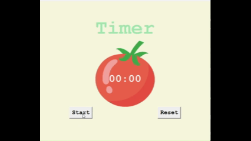

# ⏰ Pomodoro GUI Application

Welcome to the **Pomodoro GUI Application** — a Python-based desktop tool that helps you manage your time effectively using the famous **Pomodoro Technique**. Boost your focus, track your progress, and get things done!

---

## 🌟 Why Use This App?

- 🔄 **Automatic Cycles**: Switch between work and break sessions effortlessly.
- 🎨 **Color-Coded Interface**: Instantly know your current mode (Work/Break).
- ✅ **Progress Tracker**: Get a checkmark for every completed Pomodoro.
- 🧼 **Reset Option**: Start fresh anytime.
- 💡 **User-Friendly GUI**: Built with `Tkinter` for a clean and simple experience.

---

## 📸 Live Preview



_📝 **Note:** This GIF runs faster than normal for demo purposes._

---

## 🚀 Getting Started

### 🔧 Requirements
- Python 3.x
- Tkinter (comes pre-installed with Python)

### ▶️ Run It
```bash
# Clone the repository
git clone https://github.com/yourusername/pomodoro-gui-app.git

# Move into project folder
cd pomodoro-gui-app

# Start the app
python main.py
```

---

## 📂 Project Structure
```
├── main.py            # Main application logic
├── demo.gif           # Demo preview (sped up)
├── README.md          # This file
├──tomato.png          # Tomato image
```

---

## 🧠 How It Works

1. **Work Session**: 25 minutes of focused work
2. **Short Break**: 5 minutes to refresh
3. **Every 4th Break**: 20-minute long break
4. **Cycle Repeats**: Keep going until your task is done!

---

## 🔧 Built With

- Python 🐍
- Tkinter 🖼️ (GUI library)

---

## 🙋‍♂️ Author

Developed with 💻 and ❤️ by **Saurabh Kulshrestha**

---

> "Time is what we want most, but what we use worst." — William Penn

